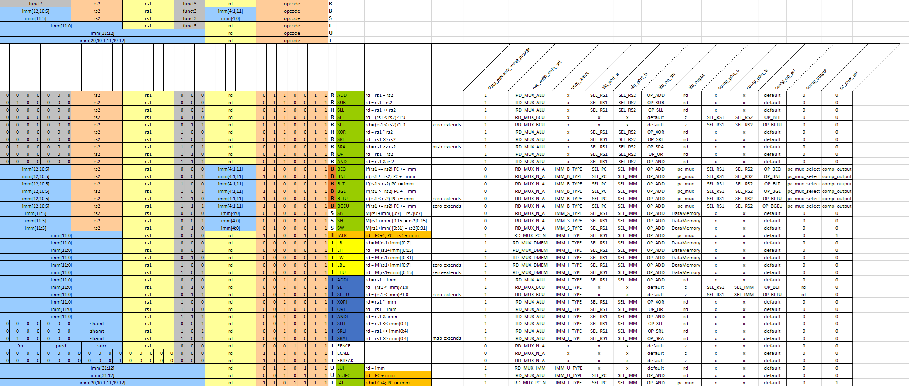
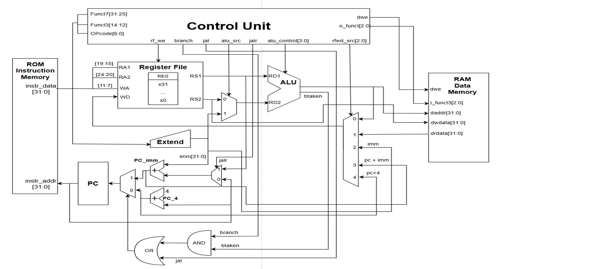
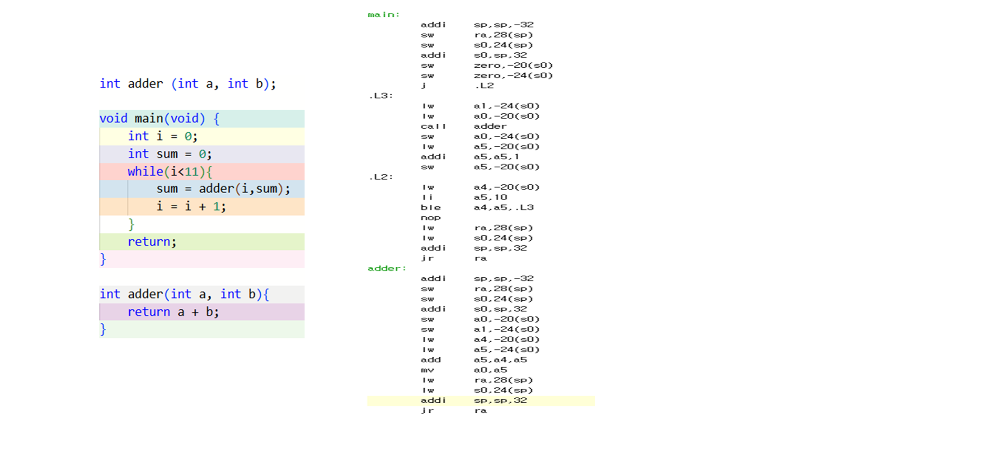

Tool : Vivado

I made RISCV-32I SINGLECYCLE(OPEN ISA source)

Design Goal

I use 9 types because there are 9 types of OPcode(except FENCE, ECALL, EBREAK) 
TYPE : R_TYPE, B_TYPE, S_TYPE, JALR_TYPE, IL_TYPE, I_TYPE, LUI_TYPE, AUIPC_TYPE, JAL_TYPE 

Function  
R_TYPE = Pure Calculation Type  
B_TYPE = Jump to a different position when the condition is met  
S_TYPE = Save the values in the register to memory  
JALR_TYPE = When making a function call in Register, jump to the function position and store the address to return 
IL_TYPE = Read data from memory and import to register 
I_TYPE = almost same like R_TYPE, but required when calculating by adding a small constant immediately(Imm) 
LUI_TYPE = Create high value top 20 bits, Why do you need it? Other reminders usually only handle 12 bits, so you can't create big constants or big addresses at once. So first, you need a command to make the top 
AUIPC_TYPE = Calculate the address based on the current PC, Why do you need it? The program can vary where the memory goes, so it needs to calculate the address based on the current location (PC-relative) rather than the absolute address 
JAL_TYPE = When making a function call on your PC, jump to the function position and store the address that will come back 

Block Diagram

After completing the RTL code, the verification is carried out using the C code SUM 

in the bottom, it is my presentation.   
[RISCV-32I_정민수.pptx](https://github.com/user-attachments/files/26041418/RISCV-32I_.pptx)
