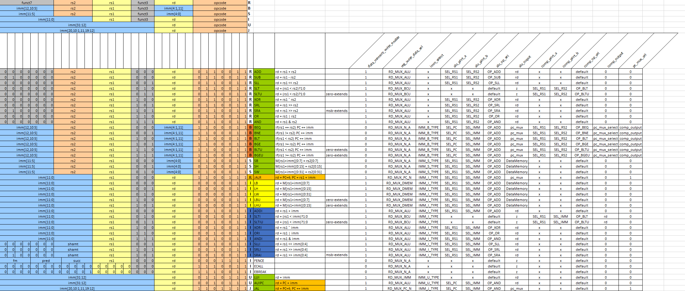
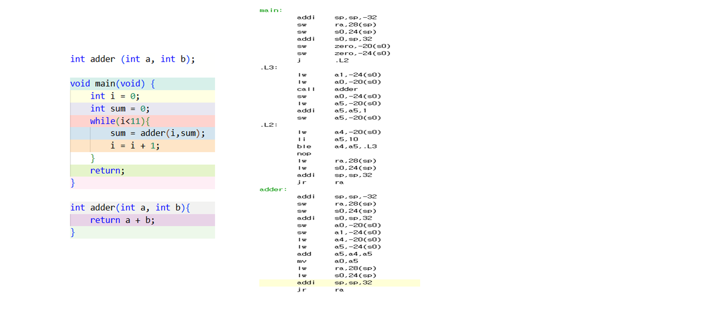

# RISC-V RV32I Single-Cycle CPU

Tool : Vivado  
Architecture : Harvard  

I made RISC-V RV32I Single-Cycle CPU.  
RISC-V is an open ISA.

---

## Design Goal

I used 9 types because there are 9 types of opcode except `FENCE`, `ECALL`, and `EBREAK`.

## Instruction Types

| Type | Function |
|---|---|
| `R_TYPE` | Pure calculation type |
| `B_TYPE` | Jump to a different position when the condition is met |
| `S_TYPE` | Save the values in the register to memory |
| `JALR_TYPE` | When making a function call using a register, jump to the function position and store the return address |
| `IL_TYPE` | Read data from memory and import it to register |
| `I_TYPE` | Almost same as `R_TYPE`, but used when calculating with a small immediate constant |
| `LUI_TYPE` | Create high value top 20 bits. Other immediate fields usually handle only 12 bits, so this is needed to create big constants or big addresses |
| `AUIPC_TYPE` | Calculate the address based on the current PC. It is used for PC-relative address calculation instead of absolute address calculation |
| `JAL_TYPE` | When making a function call using the PC, jump to the function position and store the return address |

---

## Block Diagram

---

## Verification

After completing the RTL code, the verification was carried out using the C code SUM.

The simulation result and assembly code should be compared to check whether the designed RISC-V RV32I CPU works correctly.

---

## Presentation

In the bottom, it is my presentation.

- [RISCV-32I_정민수.pptx](RISCV-32I_정민수.pptx)
