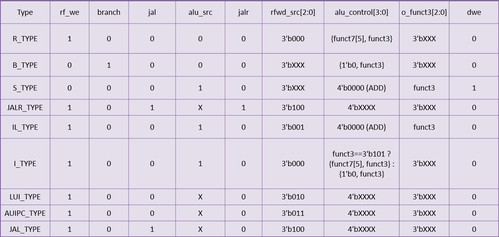

총 2가지의 유형이 존재.
1. 하버드 아키텍처
    명령어 메모리와 데이터 메모리가 분리되어 있음.
  장점
    1) 명령어 fetch랑 데이터 access를 동시에 할 수 있음. 그래서 속도 면에서 유리함
    2) 파이프라인 설계할 때 편함
    3) 주소가 총 32비트가 존재함.
  단점
    1) 구조가 좀 더 복잡해짐
    2) 메모리를 따로 관리해야 함
2. 폰노이만 아키텍처
    명령어와 데이터가 같은 메모리를 씀.
  장점
    1) 구조가 단순함
    2) 설계가 쉬움
    3) 메모리 공간을 유연하게 쓸 수 있음
  단점
    1) 명령어 읽기와 데이터 접근이 동시에 몰리면 충돌남
    2) 이걸 Von Neumann bottleneck 이라고 함

하버드 구조로 설계를 진행함.

각 모듈 설명
1. PC = Instruction의 실행순서를 결정, PC + 4 or JUMP(분기)
2. Instruction Memory = Instruction을 저장한 memory, Byte Address를 사용
3. Register File = ALU 연산을 위한 임시 저장 공간
4. ALU = 연산기( + , - , / , * , >>, and, or 등등), 출력 결과를 Register File or Memory에 저장
5. Data Memory = Data를 저장 or 불러오기 위한 memory
6. Control Unit = CPU의 동작을 제어함 (총 9가지의 TYPE)
    

1. 단순 연산 TYPE
   1) R-TYPE : Register에 저장되어있는 RS1, RS2값을 ALU를 통해 연산을 함
   2) I-TYPE : Register에 저장되어있는 RS1 값과 Imm값(초기화X)을 ALU를 통해 연산을 함.
                SUB가 없는데, 이는 ADDI로 대체가 가능해서 그럼.
2. 분기(JUMP) TYPE 
   1) B-TYPE : 돌아올 주소를 Register File에 저장하지않으며, 조건이 참일때 분기(JUMP)함
   2) JALR-TYPE : 함수가 호출되면, 돌아올 주소를 Register File에 PC+4로 저장하며, register에서 분기(JUMP)함.
   3) JAL-TYPE : 함수가 호출되면, 돌아올 주소를 Register File에 PC+4로 저장하며, PC에서 분기(JUMP)함.

3. 큰 주소 TYPE(어떤 명령어들은 immediate가 12비트밖에 되지 않아 32비트 큰 값이나 큰 주소를 한 번에 만들 수 없다) 
   1)LUI : LUI가 상위 20비트를 먼저 만들고, 이후 addi, lw, sw, jalr 같은 12비트 immediate 명령어와 조합해서 하위 12비트를 채운다. 
             EX) 12345678이면 12345000을 미리 저장해놓고(LUI) 나중에 12비트의 값을 채워넣음. 
            상위 20비트 imm + 하위 12비트 (12 imm을 사용하는 다른 명령어) 
                rd = imm << 12 
   2)AUIPC : 현재 PC를 기준으로 먼 주소를 써야 할 때, 작은 immediate(12비트)만으로는 부족함 
            그래서 AUIPC가 PC + (상위 20비트 << 12) 를 먼저 계산해서 레지스터에 넣어둠 
            그 다음 다른 명령어가 하위 12비트를 더해서 진짜 목표 주소를 완성함 
                rd = pc + (imm << 12) 현재 pc값 기준 

